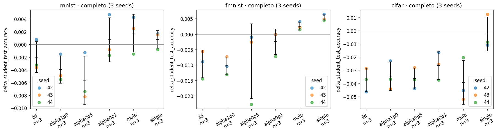
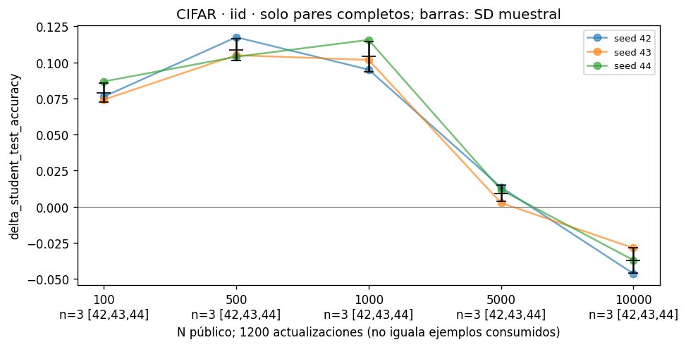
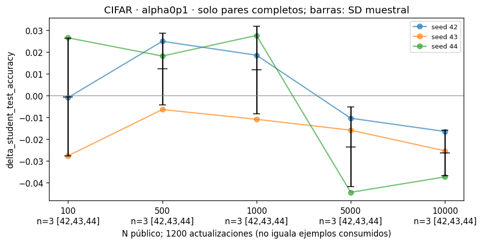
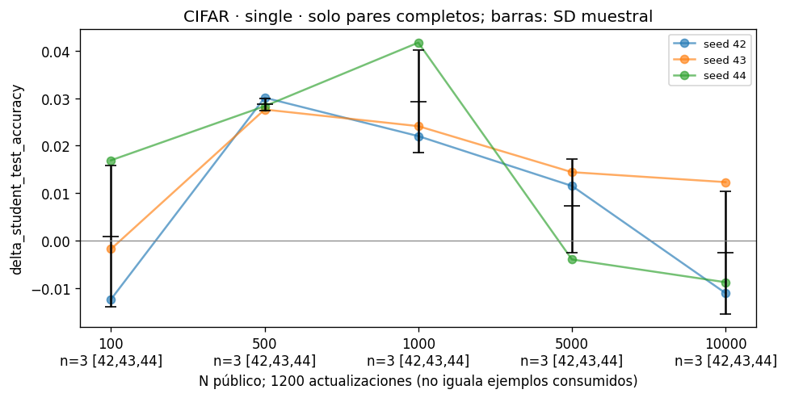
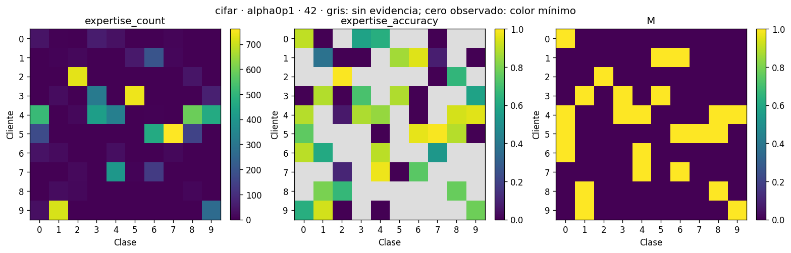

# Artículo 1: cierre principal y curva completa

Instantánea UTC: 2026-09-09T21:48:49.851425+00:00. Análisis: `808089e8feb8f91fa80ca964a8eb1fe0e4f3090b`. Checkout de entrenamiento observado: `c643a33c5bd39dee413ca2ea296a3f85ec91d9f8`. Diseño principal detectado: **six**.

La configuración actual no se atribuye retroactivamente a procesos o caches. Las rutas, SHA256, fechas, filas y procedencia declarada están en manifest.json; los CSV se leen exclusivamente de la instantánea.

| Pregunta científica | Contraste | Figura o tabla | Observación | Interpretación defendible | Limitación | Estado |
| --- | --- | --- | --- | --- | --- | --- |
| ¿Qué acredita M? | Expertise por cliente y clase | tables/expertise_cells.csv; figures/expertise_* | 54/54 condiciones verificadas | Acredita accuracy condicional de clase con los umbrales fijados | La evidencia seleccionada no valida independientemente generalización ni rechazo OOD | cerrado |
| Selección | ORACLE-logit − FedDF-logit | tables/selection_logit_paired.csv; figures/selection_logit_student_test_accuracy.png | 54 pares; accuracy y NLL, media y SD por dataset/régimen | Comparación del procedimiento bajo receta y fuentes compartidas | Tres seeds; ORACLE no es cota garantizada; SR no demuestra destrucción de dark knowledge | cerrado |
| Operador FedDF | FedDF-prob − FedDF-logit | tables/feddf_pooling_paired.csv; figures/feddf_pooling_student_test_accuracy.png | 54 pares; accuracy y NLL, media y SD por dataset/régimen | Comparación del procedimiento bajo receta y fuentes compartidas | Tres seeds; ORACLE no es cota garantizada; SR no demuestra destrucción de dark knowledge | cerrado |
| Operador ORACLE | ORACLE-prob − ORACLE-logit | tables/oracle_pooling_paired.csv; figures/oracle_pooling_student_test_accuracy.png | 54 pares; accuracy y NLL, media y SD por dataset/régimen | Comparación del procedimiento bajo receta y fuentes compartidas | Tres seeds; ORACLE no es cota garantizada; SR no demuestra destrucción de dark knowledge | cerrado |
| Expertise | EXPERT-prob − FedDF-prob | tables/expertise_gain_paired.csv; figures/expertise_gain_student_test_accuracy.png | 54 pares; accuracy y NLL, media y SD por dataset/régimen | Comparación del procedimiento bajo receta y fuentes compartidas | Tres seeds; ORACLE no es cota garantizada; SR no demuestra destrucción de dark knowledge | cerrado |
| Gap ORACLE | ORACLE-prob − EXPERT-prob | tables/oracle_expertise_gap_paired.csv; figures/oracle_expertise_gap_student_test_accuracy.png | 54 pares; accuracy y NLL, media y SD por dataset/régimen | Comparación del procedimiento bajo receta y fuentes compartidas | Tres seeds; ORACLE no es cota garantizada; SR no demuestra destrucción de dark knowledge | cerrado |
| Soporte | EXPERT-prob-SR − EXPERT-prob | tables/support_paired.csv; figures/support_student_test_accuracy.png | 54 pares; accuracy y NLL, media y SD por dataset/régimen | Comparación del procedimiento bajo receta y fuentes compartidas | Tres seeds; ORACLE no es cota garantizada; SR no demuestra destrucción de dark knowledge | cerrado |
| ¿Qué añade el conocimiento privado frente a etiquetas públicas? | EXPERT-prob − CE, N=10000 | tables/private_knowledge_summary.csv; figures/private_knowledge_* | 54/54 pares; 9/9 CE únicos | Cuantifica la diferencia del sistema KD frente a CE con el mismo proxy etiquetado | Solo N=10000; también cambia el objetivo CE/KD; CE reutilizado no crea nuevas réplicas | cerrado |
| ¿Cómo cambia KD−CE con N? | CIFAR, IID/alpha0p1/single; 1200 updates | tables/proxy_budget_completeness.csv; tables/proxy_curve_summary.csv; figures/curve_* | 60/60 ejecuciones, 45/45 pares | Se describen únicamente tamaños y seeds observados | Huecos no son ceros; seeds distintas no definen medias comparables; cruce no es óptimo | cerrado |
| ¿Aportan otros controles? | EXPERT-logit, Confidence, Consensus, Energy | tables/contrast_summary.csv; tables/*_excluded.csv | Se conservan ejecuciones adicionales verificadas del respaldo, sin contarlas como baseline nuevo | Contrastes adicionales solo en condiciones emparejadas | Su incompletitud no impide cerrar el diseño principal de seis métodos | provisional |

## Conocimiento privado frente a CE, N=10000

| dataset | regime | accuracy_pp | SD_pp | mean_nll | sd_nll | n | seeds |
| --- | --- | --- | --- | --- | --- | --- | --- |
| cifar | alpha0p1 | -2.643 | 1.049 | 0.1533 | 0.1069 | 3 | 42,43,44 |
| cifar | alpha0p5 | -3.633 | 0.798 | -0.0849 | 0.0685 | 3 | 42,43,44 |
| cifar | alpha1p0 | -3.457 | 1.082 | -0.11 | 0.0503 | 3 | 42,43,44 |
| cifar | iid | -3.73 | 0.885 | -0.1132 | 0.0544 | 3 | 42,43,44 |
| cifar | multi | -3.917 | 1.657 | 0.7003 | 0.0155 | 3 | 42,43,44 |
| cifar | single | -0.253 | 1.29 | 0.8369 | 0.1662 | 3 | 42,43,44 |
| fmnist | alpha0p1 | -0.247 | 0.41 | 0.1132 | 0.054 | 3 | 42,43,44 |
| fmnist | alpha0p5 | -0.877 | 1.209 | -0.0115 | 0.0719 | 3 | 42,43,44 |
| fmnist | alpha1p0 | -1.027 | 0.29 | -0.019 | 0.0382 | 3 | 42,43,44 |
| fmnist | iid | -0.967 | 0.45 | -0.0492 | 0.0439 | 3 | 42,43,44 |
| fmnist | multi | 0.257 | 0.129 | 1.3041 | 0.0895 | 3 | 42,43,44 |
| fmnist | single | 0.523 | 0.104 | 2.5411 | 0.2475 | 3 | 42,43,44 |
| mnist | alpha0p1 | 0.073 | 0.346 | 0.0001 | 0.0112 | 3 | 42,43,44 |
| mnist | alpha0p5 | -0.563 | 0.377 | 0.0143 | 0.0074 | 3 | 42,43,44 |
| mnist | alpha1p0 | -0.397 | 0.216 | 0.0047 | 0.0039 | 3 | 42,43,44 |
| mnist | iid | -0.2 | 0.243 | 0.0005 | 0.0058 | 3 | 42,43,44 |
| mnist | multi | 0.177 | 0.297 | 0.0663 | 0.0211 | 3 | 42,43,44 |
| mnist | single | 0.08 | 0.139 | 0.2543 | 0.0383 | 3 | 42,43,44 |

cifar: diferencia media de accuracy positiva en ningún régimen y negativa en ['alpha0p1', 'alpha0p5', 'alpha1p0', 'iid', 'multi', 'single']. Es una descripción de estas tres seeds, no una declaración de superioridad universal o equivalencia.

fmnist: diferencia media de accuracy positiva en ['multi', 'single'] y negativa en ['alpha0p1', 'alpha0p5', 'alpha1p0', 'iid']. Es una descripción de estas tres seeds, no una declaración de superioridad universal o equivalencia.

mnist: diferencia media de accuracy positiva en ['alpha0p1', 'multi', 'single'] y negativa en ['alpha0p5', 'alpha1p0', 'iid']. Es una descripción de estas tres seeds, no una declaración de superioridad universal o equivalencia.

## Curva CIFAR: EXPERT-prob − CE

| regime | proxy_size | accuracy_pp | SD_pp | mean_nll | sd_nll | n | seeds |
| --- | --- | --- | --- | --- | --- | --- | --- |
| alpha0p1 | 100 | -0.067 | 2.715 | 0.0111 | 0.2125 | 3 | 42,43,44 |
| alpha0p1 | 500 | 1.227 | 1.652 | -0.1252 | 0.2477 | 3 | 42,43,44 |
| alpha0p1 | 1000 | 1.18 | 2.018 | -0.1002 | 0.1911 | 3 | 42,43,44 |
| alpha0p1 | 5000 | -2.36 | 1.831 | 0.1204 | 0.0855 | 3 | 42,43,44 |
| alpha0p1 | 10000 | -2.643 | 1.049 | 0.1533 | 0.1069 | 3 | 42,43,44 |
| iid | 100 | 7.91 | 0.675 | -1.0827 | 0.1241 | 3 | 42,43,44 |
| iid | 500 | 10.88 | 0.755 | -1.0452 | 0.0327 | 3 | 42,43,44 |
| iid | 1000 | 10.41 | 1.051 | -0.9642 | 0.1357 | 3 | 42,43,44 |
| iid | 5000 | 0.93 | 0.579 | -0.3973 | 0.0457 | 3 | 42,43,44 |
| iid | 10000 | -3.73 | 0.885 | -0.1132 | 0.0544 | 3 | 42,43,44 |
| single | 100 | 0.09 | 1.484 | 1.4797 | 0.1979 | 3 | 42,43,44 |
| single | 500 | 2.867 | 0.129 | 0.9671 | 0.2007 | 3 | 42,43,44 |
| single | 1000 | 2.927 | 1.082 | 0.8606 | 0.0488 | 3 | 42,43,44 |
| single | 5000 | 0.73 | 0.989 | 0.8032 | 0.1398 | 3 | 42,43,44 |
| single | 10000 | -0.253 | 1.29 | 0.8369 | 0.1662 | 3 | 42,43,44 |

alpha0p1: cambios de signo de la diferencia media de accuracy entre tamaños adyacentes con las mismas seeds: 100–500, 1000–5000. Son intervalos descriptivos de estas seeds, sin demostrar un mínimo suficiente ni un tamaño óptimo.

iid: cambios de signo de la diferencia media de accuracy entre tamaños adyacentes con las mismas seeds: 5000–10000. Son intervalos descriptivos de estas seeds, sin demostrar un mínimo suficiente ni un tamaño óptimo.

single: cambios de signo de la diferencia media de accuracy entre tamaños adyacentes con las mismas seeds: 5000–10000. Son intervalos descriptivos de estas seeds, sin demostrar un mínimo suficiente ni un tamaño óptimo.

## Interpretación y límites

Las figuras principales muestran puntos por seed, diferencias emparejadas, media y SD muestral. No se agrupan los tres datasets como réplicas intercambiables. Las relaciones entre cobertura, soporte y efecto de expertise están en coverage_support_results.csv y figuras descriptivas sin ajuste causal. Dirichlet también altera cantidades; los regímenes no aíslan exclusivamente especialización.

Validation selecciona checkpoints; expertise construye M. No hay test local independiente en v3 ni curvas por época almacenadas. Los soportes escasos no introducen nuevas reglas. No se concluye equivalencia por falta de significación, ni pérdida causal de dark knowledge por un efecto de SR. No se eligieron temperaturas, thresholds o variantes con test.

Checkpoint bytes fingerprinted and all ten files present; metadata only declares state hashes. These cannot be independently matched without deserializing checkpoints, forbidden here. Cache and partition hashes are verified.

No se entrenó, no se infirió de nuevo, no se usó CUDA y no se modificó el checkout activo. Los CSV opcionales vacíos no acreditan ejecuciones; los duplicados de maestro/bloques se reutilizan solo tras comprobar igualdad.

## Procedimiento final completado; futuras actualizaciones

1. Tomar una nueva instantánea y auditar las 60 ejecuciones CIFAR y los 45 pares.
2. Ejecutar el notebook de presupuesto con modo definitivo y regenerar figuras de N.
3. Revisar conclusiones y captions con las seeds realmente disponibles.
4. Separar las preguntas resueltas de las pendientes.
5. Decidir posteriormente si estudiar temperatura, más controles o viabilidad unlabeled; aquí no se implementa ni lanza unlabeled.

Un cruce solo se localiza entre N evaluados, no demuestra un tamaño óptimo. El presupuesto iguala actualizaciones, no necesariamente ejemplos consumidos; examples_consumed.csv conserva ambos.

## Artefactos de revisión

Esta carpeta contiene el manifiesto y tablas/figuras de revisión. Los entregables completos, incluidos tres notebooks ejecutados, 52 CSV y 101 figuras en PNG y PDF, están en `/tmp/article1-closure-output/20260909T214849851047Z/`. No se publican datasets, caches ni checkpoints.

Caption: diferencia de accuracy en fracción (0.01 = 1 pp), N=10000, 1200 updates y tres seeds. CE se reutiliza entre regímenes sin crear réplicas nuevas. Barras: SD muestral.

Caption: KD−CE con tres pares compatibles por tamaño; líneas individuales por seed y media con SD muestral. El presupuesto fija 1200 actualizaciones, no iguala ejemplos consumidos. Los cambios de signo no demuestran tamaños óptimos.

Caption: KD−CE con tres pares compatibles por tamaño; líneas individuales por seed y media con SD muestral. El presupuesto fija 1200 actualizaciones, no iguala ejemplos consumidos. Los cambios de signo no demuestran tamaños óptimos.

Caption: KD−CE con tres pares compatibles por tamaño; líneas individuales por seed y media con SD muestral. El presupuesto fija 1200 actualizaciones, no iguala ejemplos consumidos. Los cambios de signo no demuestran tamaños óptimos.

Caption: clientes y clases en orden 0–9. Gris en accuracy indica falta de evidencia; color mínimo con count positivo indica accuracy observada cero. M aplica el umbral fijado 0.70; no acredita rechazo OOD.

Validación: 38 pruebas superadas; tres notebooks ejecutados sin errores en CPU, un hilo. Coincidieron los 488 diagnósticos KD reconstruidos del principal y respaldo. La curva definitiva verificó 60/60 ejecuciones únicas y 45/45 pares, sin exclusiones; subconjuntos, fallback y CRN comprobados.
