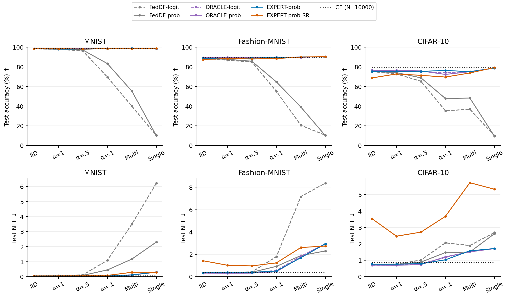
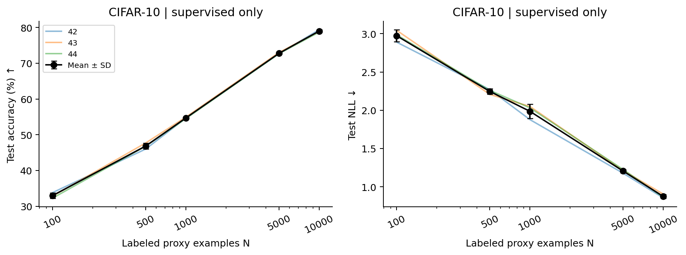
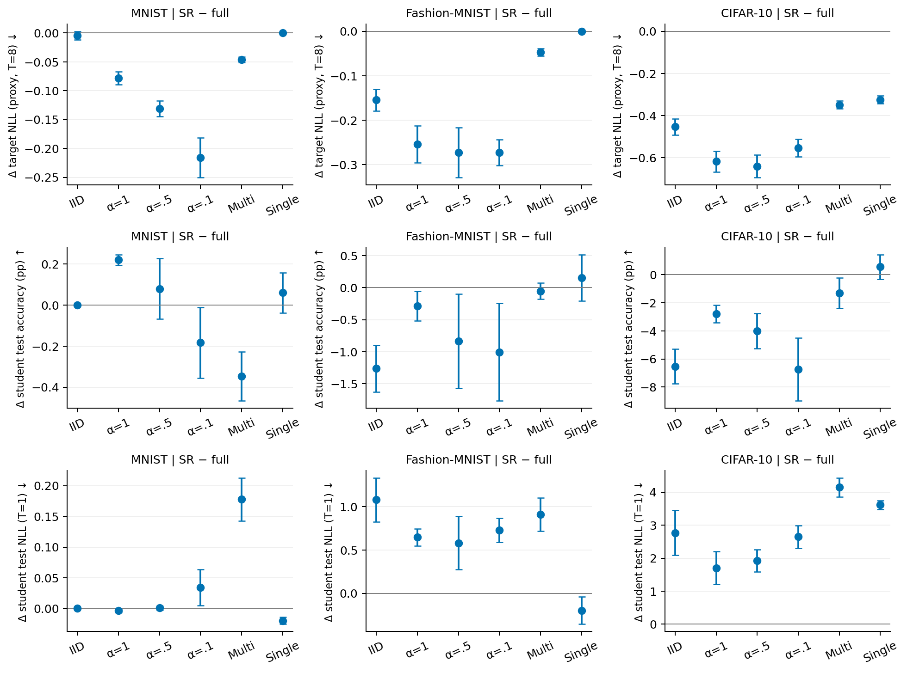

# Hypotheses, figures and remaining studies

Evidence: published closure snapshot, 2026-09-09 21:48 UTC. All statements below are descriptive of the available seeds. This is a retrospective research map, not preregistration.

| Question/hypothesis | What the data support | Best figure | Remaining scope |
|---|---|---|---|
| H1. Selection helps under specialization | EXPERT-prob−uniform CIFAR: −0.08 pp IID, +28.56 alpha0p1, +69.29 single | Absolute overview of six methods + CE; paired routing effects alongside it | Distinguish label/M information from a causal effect of specialization alone |
| H2. Class expertise can approach sample-wise ORACLE | Small gaps in several conditions; CIFAR alpha0p1 ORACLE−EXPERT = −4.06 pp | Paired ORACLE−EXPERT effects with zero line, accuracy and NLL | ORACLE is not an upper bound; proximity is not equivalence |
| H3. Pooling space may be interchangeable at T=8 | Not supported generally: FedDF-prob gains +12.54 pp over logit in CIFAR alpha0p1 | Separate prob−logit panels for FedDF and ORACLE | Direct EXPERT comparison has 41/54 pairs; 13 missing; temperature robustness not closed |
| H4. Restriction removes unhelpful out-of-support predictions | Target NLL falls; does not imply student improvement | Three aligned rows: Δtarget NLL, Δstudent accuracy, Δstudent NLL | Avoid generalizing the direction of student effects across datasets |
| H5. Full outputs contain useful dark knowledge | Compatible with CIFAR SR losses; mechanism not identified | Support triptych, all regimes, paired mean ± SD | Confidence/concentration also change; consider full-support entropy-matched control as a future diagnostic |
| H6. KD adds value beyond public labels | At N=10000 CIFAR mean accuracy is lower than CE in every regime | Absolute overview and EXPERT−CE paired effects | Different objectives CE/KD; does not isolate private knowledge alone |
| H7. Utility depends on public-label budget | CIFAR IID gain +10.88 pp at N=500, −3.73 at N=10000 | CE-only absolute curve, then KD−CE curve, both accuracy and NLL | CIFAR only; no optimal N or continuous crossover estimated |
| H8. Mask quality/coverage explains benefits | Coverage, supports and fallback are recorded | M/count heatmaps, experts per class, descriptive coverage vs effect | No causal identification; thresholds fixed; compare measured expertise vs training-class presence if claiming value of calibration |
| H9. Prediction-only controls could replace M+y | 41/54 comparable conditions for each archived arm | Paired controls vs uniform/EXPERT, coverage shown | 13 missing per control; no claim of complete SOTA comparison |
| H10. Unlabeled synthesis from specialists is viable | Not evaluated | Future target-only diagnostics: class scores vs samples, entropy and coverage | M measures conditional accuracy, not OOD rejection; single specialists may yield nearly constant scores |

## Corrections to the dark-knowledge statement

The measured statement is **lower target NLL can coexist with lower student accuracy**. It is not “both student NLL and student accuracy decrease” in general. In CIFAR, SR−full target NLL is negative in all six regimes, student accuracy is negative in five, and student NLL is positive in all six. In IID the changes are −0.4534, −6.533 pp and +2.7703 respectively. In single, accuracy increases by +0.573 pp while student NLL still increases by +3.6153.

Labeled routing guarantees that every selected teacher's support contains the true class. Restriction renormalizes by a denominator ≤1, so its true-class probability cannot decrease. The common fallback is unchanged. Consequently, target NLL nonincrease is an algebraic property of this construction (up to numerical handling), not a new independent generalization test. Target NLL is measured on training proxy targets at T=8; student NLL is measured on the official test at T=1.

To investigate dark knowledge causally, separate support removal from target concentration/confidence. A full-support control matched in entropy could be informative, but is a **new, unexecuted study** whose matching rule and evaluation must be specified before launching. It would still not automatically isolate every interclass-information effect. No tuning against the official test.

## What can be drawn from the published summaries?

The overview displays means for six complete KD methods and CE at N=10000. It does not fabricate missing per-method variances. Let E be the published absolute EXPERT mean and Δ(A−B) the mean paired difference over the same three seeds:

- FedDF-prob = E − Δ(EXPERT-prob−FedDF-prob).
- FedDF-logit = FedDF-prob − Δ(FedDF-prob−FedDF-logit).
- ORACLE-prob = E + Δ(ORACLE-prob−EXPERT-prob).
- ORACLE-logit = ORACLE-prob − Δ(ORACLE-prob−ORACLE-logit).
- SR = E + Δ(SR−EXPERT-prob).

These follow from linearity of the mean; independent selection/pooling paths are checked for consistency. SD cannot be reconstructed this way without covariances. The figure is an orientation panel, not an uncertainty test. Absolute per-method seed values and SD should be exported from the original full snapshot for the submission version.

CE-only uses the observed right-hand values in the curve pairs, validates repeated references and counts each `(seed,N)` once. There are 15 CE runs, not 45 independent CE observations. Only CIFAR has the five-size curve. Pairwise effects retain their published sample SD; no independent seed points are reconstructed from summaries.

## Pending decisions, in priority order

1. Export original absolute student rows and per-seed main contrasts to complete uncertainty and auditability of the overview. No training needed.
2. Complete literature/novelty review and choose the journal/conference scope. Uniform pooling and label-informed ORACLE do not alone establish SOTA superiority.
3. Decide whether the paper claims an advantage of **measuring** competence rather than merely recording local class presence. If so, prioritize that mask control; it is not covered by current results.
4. Decide whether to complete direct EXPERT pooling (13 missing full-grid cells, or seven missing CIFAR focal anchors) and prediction-only controls (13 each). These are alternative scopes; do not double-count or rerun archived identities.
5. If generalizing HOW beyond T=8, define the focal temperature study (36 T=1/4 cells if absent), with T=8 anchors reused. Do not choose a winning T from test.
6. Treat thresholds/minimum evidence, extra seeds and new datasets/architectures as explicitly chosen robustness studies, not automatic grids.
7. Reserve unlabeled proxy synthesis, expertise inference/uncertainty/OOD, model inversion and second distillation/personalization for subsequent work. None has been validated here.

No new experiments were run for these figure corrections. The notebook now orders the narrative as absolute overview → paired routing → pooling/support → CE at full proxy → CE-only size curve → KD−CE size curve.

## New figures

N=10000, 1200 updates, six KD methods plus CE. Means only; different label/mask information budgets are explicit. Accuracy uses a common 0–100% scale. NLL scales differ by dataset. Lines connect categorical regimes for readability.

CIFAR-only data-budget curve, 15 unique CE runs; three seeds and mean ± sample SD. It is not an epoch trajectory.

SR−full, all 18 dataset/regime groups, three paired seeds each. Rows use separate metrics and scales: target NLL on proxy at T=8; student accuracy; student NLL on test at T=1. Bars are sample SD, not confidence intervals or a causal test.

Validation: 87 tests passed, eight runtime tests skipped because torch/torchvision are unavailable. New Python files pass lint. All notebook code cells executed sequentially in IPython; no external Jupyter kernel was used. All three new figures were visually inspected. The full notebook exports 12 figures in PNG/PDF and six CSV tables. No experiments were trained or original result files modified.
