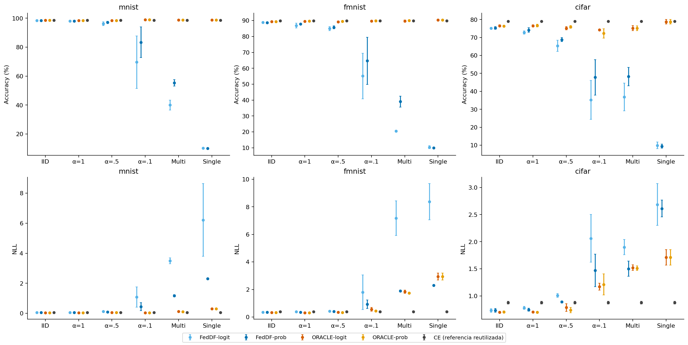
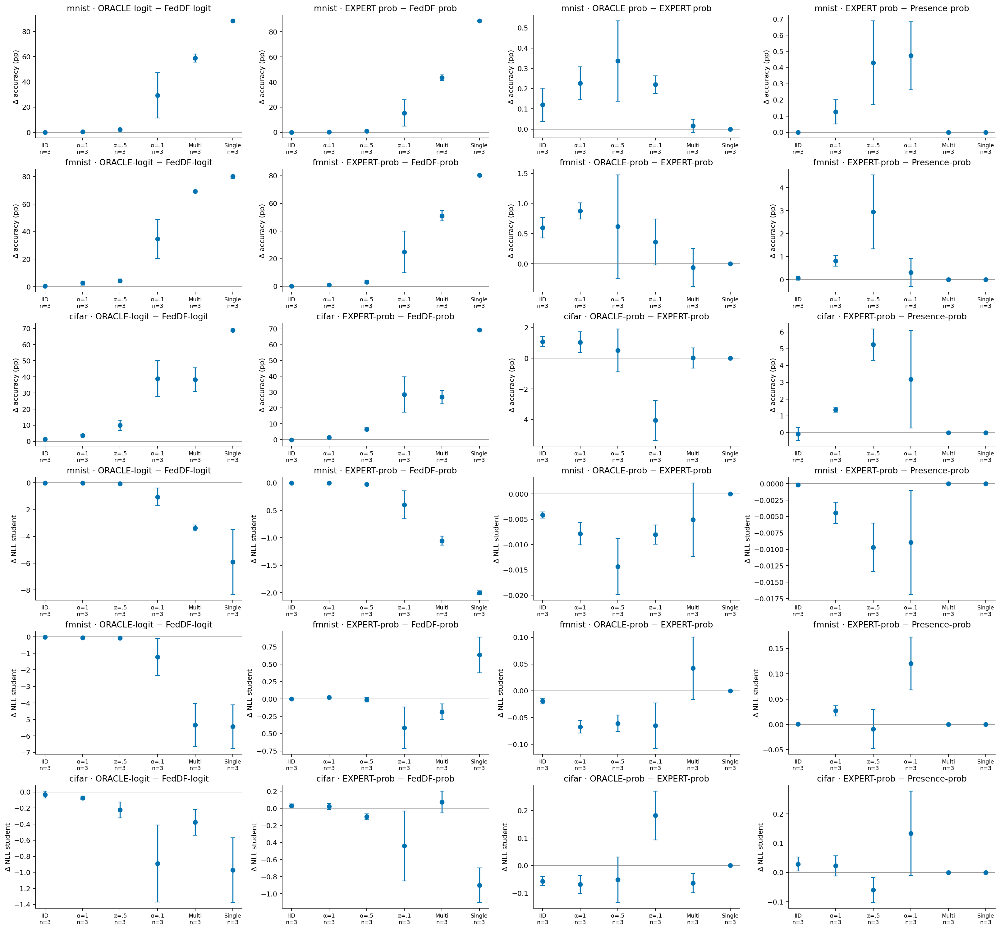
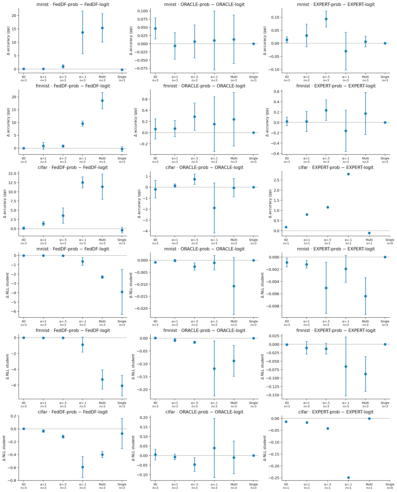
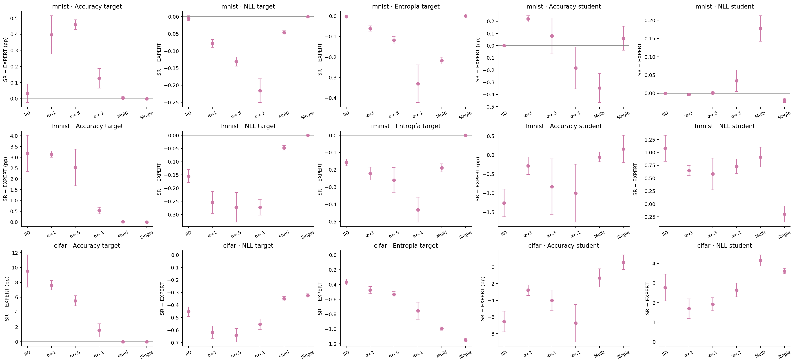
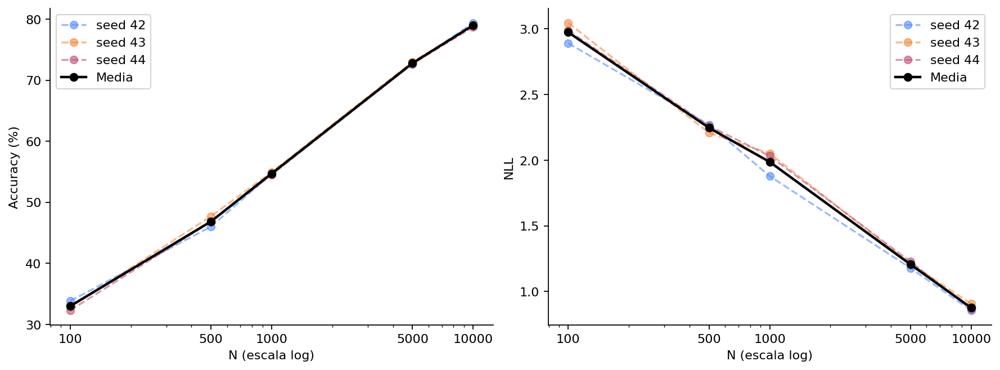
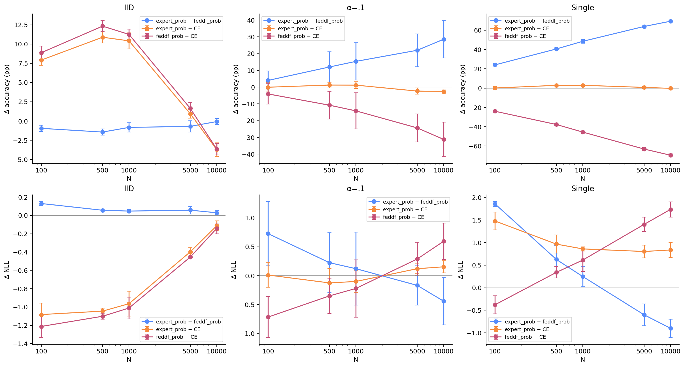

# Who and What to Teach: Class Presence and Measured Competence in One-Shot Federated Distillation

*A controlled study with a labeled public proxy*

> Working draft v0.2, 14 September 2026. Evidence is frozen to the audit published at commit b43da870bc5a20f7c533089b4145503fdfe995cc. Authors and venue remain to be specified. Editorial decisions and unresolved submission checks are kept in plan.md rather than mixed with the paper text.

## Abstract

One-shot federated distillation combines local teachers into a global student, but class specialization makes their contributions uneven. We study whether selecting teachers by measured class competence adds value beyond knowing which classes they encountered during training, and whether restricting selected teachers' outputs improves the distilled student. Our protocol uses a labeled public proxy and separate private training, validation and expertise splits. Across three datasets, six client allocations and three seeds, we compare selection rules, logit and probability pooling, support restriction, and proxy-only supervision. The agreed study contains 471 student runs. Under disjoint two-class and single-class allocations, presence and expertise masks coincide in the observed conditions: large improvements over uniform pooling do not establish an additional benefit from measuring competence there. Under CIFAR-10 Dirichlet allocation with alpha=0.5, measured competence adds 5.25 percentage points of mean accuracy over presence, while other regimes expose accuracy–likelihood trade-offs. Restriction lowers target negative log-likelihood in all six CIFAR-10 regimes but increases student negative log-likelihood in all six and reduces student accuracy in five. Finally, a proxy-size study shows that improvements over uniform distillation need not imply improvements over direct supervision. These results distinguish support-aware selection from competence accreditation and identify limits to inferring student utility from target quality.

## 1. Introduction

One-shot federated distillation constructs a global student from independently trained local models without further rounds of client optimization. Distillation transfers an ensemble's outputs into a single model [1], and federated model fusion extends this principle to client models [2,3]. Under heterogeneous class allocations, however, the server must decide which teachers should contribute to each proxy example and which parts of their predictions should be transferred.

Class presence and predictive competence provide different answers to the first question. A teacher may have encountered a class without predicting it reliably. Conversely, excluding teachers that never trained on a class may already explain much of the improvement obtained by a more elaborate competence rule. A comparison against uniform aggregation alone cannot distinguish these explanations. This distinction is particularly relevant when classes are distributed in disjoint groups: a competence mask may reproduce the training-presence mask exactly.

Contributor selection and output restriction address different questions. After choosing a teacher for a proxy example, the server can preserve its complete class distribution or remove probabilities outside its accredited classes. Complete distributions may convey useful interclass relationships, but restriction also changes their concentration. Moreover, if selection uses the true proxy label, restriction can improve target likelihood by construction. An apparently better target is therefore not sufficient evidence of a better distilled student.

We study these choices with a labeled public proxy and a binary expertise mask estimated after teacher checkpoint selection. EXPERT selects teachers accredited for the proxy label and averages their full probability vectors. A training-presence control replaces accreditation with a record of observed training classes, while ORACLE selects teachers whose top prediction is correct for the individual sample. We compare pooling operators and restrict the outputs of the same selected experts. Related studies already consider certainty-weighted federated distillation and monoclass teachers [4,5]; our question concerns the incremental utility and limitations of these specific information sources under a shared experimental protocol.

The availability of public labels also changes the practical reference point. A student can learn directly from those labels without accessing teachers. We therefore compare EXPERT and uniform distillation with proxy-only cross-entropy training over nested proxy subsets. This separates recovering performance relative to an unsuitable ensemble target from adding value beyond direct supervision.

Our contributions are threefold. First, we evaluate training presence and measured competence as distinct routing signals using the same teachers and student-training controls. Second, we separate contributor selection, pooling and output restriction, and show why their target-level diagnostics must be interpreted alongside student accuracy and likelihood. Third, we evaluate both uniform and expertise-based distillation against direct supervision across public-label budgets. The contribution is a controlled empirical characterization of these choices, not a claim that teacher selection or specialist distillation is itself new.

## 2. Related work and positioning

### 2.1. Distillation and federated model fusion

Knowledge distillation compresses predictive information from a model or ensemble into a student; the original formulation also discusses ensembles containing specialist models [1]. FedMD applies distillation to collaboration between participants with independently designed architectures [2]. FedDF develops ensemble-based server model fusion using client predictions on unlabeled auxiliary data [3]. These works establish distillation as a mechanism for combining models, rather than establish the value of the particular class-conditional accreditation rule examined here.

Our FedDF-logit label denotes a uniform logit-pooling reference within the implemented one-shot recipe. It does not identify a full reproduction of the original iterative FedDF protocol. The companion FedDF-prob arm changes only the pooling operator. Because the present experiments use fixed architectures within each dataset, they also do not test the architecture-heterogeneity capabilities motivating these earlier methods.

### 2.2. Unequal teacher contributions and specialization

FedAUX combines auxiliary-data pretraining with certainty-based weighting of ensemble predictions [4]. This is relevant prior art for assigning unequal influence to teachers. Our mask uses class-conditional accuracy on a private expertise split, while routing additionally uses the labeled proxy. These information sources and training procedures differ; we do not treat our internal confidence or energy controls as implementations of FedAUX.

Maron, Fresse and Orzalesi study one-shot distillation from monoclass teachers, explicitly addressing knowledge fragmentation and out-of-distribution supervision [5]. Their setting is directly relevant to the single-class endpoint considered here. Accordingly, our contribution is not the discovery that monoclass specialization affects knowledge transfer. The present evidence instead contrasts presence with measured competence across IID, Dirichlet and disjoint allocations, then relates output restriction and proxy budgets to student accuracy and NLL. This describes our experimental scope; it does not assert that every component is absent from that prior work.

### 2.3. Proxy resources and scope of comparison

DENSE addresses data-free one-shot federated learning through data generation followed by model distillation [6]. Our setting assumes an existing labeled proxy, so the experiments do not establish superiority over methods operating without those resources. Likewise, Federated Oriented Learning targets one-shot personalization using a broader model-alignment procedure [7], whereas our evaluated endpoint is a single global student.

We therefore position this paper as a study of routing and transfer under an explicit information budget. Uniform pooling receives teacher outputs and proxy inputs; presence and EXPERT additionally use proxy labels and client–class metadata; ORACLE uses proxy labels to select correct individual predictions. The supervised reference uses the same public labels without teacher predictions. Accounting for these differences is necessary for interpreting the contrasts and avoids conflating our internal ablations with an exhaustive state-of-the-art benchmark.

## 3. Setting and methods

### 3.1. Data roles and expertise estimation

Let K teachers solve a C-class classification task. Teacher k produces logits z_k(x) in R^C. Each client has three disjoint private subsets: training data, validation data for checkpoint selection, and expertise data for estimating class-conditional accuracy after selection. The public proxy P contains labeled pairs (x,y), is reserved before private allocation, and is disjoint from all client subsets. The official test set is reserved for final student evaluation.

For the selected, frozen teacher, let n^E_{k,c} be the number of expertise examples of class c and â^E_{k,c} its accuracy on those examples. We define

$$
M_{k,c}=\mathbf{1}\left[n^E_{k,c}>0\;\land\;\widehat a^E_{k,c}\geq\tau_d\right].
$$

The threshold τ_d is fixed per dataset. A zero mask entry denotes competence not accredited by this rule, including the case of no observations. It does not establish incompetence. In particular, the statistic measures correct prediction conditional on the true class; it does not certify rejection of inputs from other classes.

Training presence is defined separately:
$A_{k,c}=\mathbf 1[n^{train}_{k,c}>0].$
It records classes used for gradient updates, not classes observed in validation, expertise or the proxy. The presence control reconstructs A from the original training indices and verified labels, without retraining teachers. Even in an IID allocation, A need not equal M: class exposure does not guarantee that a teacher meets the competence threshold.

### 3.2. Contributor selection and pooling

At temperature T>0, define p_k^T(x)=softmax(z_k(x)/T). For a nonempty selected set S(x), the two pooling operators are

$$
q_{\mathrm{logit}}(x)=\operatorname{softmax}\left(\frac{1}{T|S(x)|}\sum_{k\in S(x)}z_k(x)\right),
\qquad
q_{\mathrm{prob}}(x)=\frac{1}{|S(x)|}\sum_{k\in S(x)}p_k^T(x).
$$

Uniform aggregation uses all teachers. EXPERT uses the proxy label and mask to select

$$S_E(x)=\{k:M_{k,y(x)}=1\}.$$

Presence-prob uses $S_A(x)=\{k:A_{k,y(x)}=1\}$ and the same full-vector probability pooling as EXPERT. The comparison changes the selection mask, leaving teachers and the pooling operator fixed. If A=M, both methods construct identical targets and, under the shared deterministic recipe, should yield identical students.

ORACLE instead selects teachers whose individual top prediction matches the proxy label:

$$S_O(x)=\{k:\arg\max_c z_{k,c}(x)=y(x)\}.$$

ORACLE is a sample-level diagnostic reference rather than a guaranteed upper bound on student performance. Both EXPERT and ORACLE exploit proxy labels, but encode different selection rules. The six-arm baseline contains uniform and ORACLE pooling in both spaces, EXPERT probability pooling, and its support-restricted variant. Presence-prob is a seventh KD arm at the full proxy, added as a separately identified control.

If a selected set is empty, all selection-based variants use the common fallback

$$q_{\mathrm{fallback}}(x)=\operatorname{softmax}\left(\frac{1}{KT}\sum_{k=1}^{K}z_k(x)\right).$$

Thus, the probability-based variants contain an explicit logit-pooling exception on fallback examples. We record these events rather than silently treating them as ordinary probability aggregation.

### 3.3. Support restriction

EXPERT-prob retains each selected teacher's complete distribution. EXPERT-prob-SR uses the same selected set but restricts each teacher separately:

$$
\widetilde p^T_{k,c}(x)=
\frac{M_{k,c}\,p^T_{k,c}(x)}{\sum_j M_{k,j}\,p^T_{k,j}(x)},
\qquad
q_{\mathrm{SR}}(x)=\frac{1}{|S_E(x)|}\sum_{k\in S_E(x)}\widetilde p_k^T(x).
$$

Every selected teacher has nonempty support because it is accredited for y(x). The implementation computes a stable softmax over supported logits, avoiding division by numerically underflowed probability mass. Empty selection still invokes the common fallback.

For a non-fallback example, restriction cannot decrease the probability each selected teacher assigns to the true class: that class remains in support and the normalization denominator is at most one. Consequently, true-class target probability cannot decrease and target NLL cannot increase. This algebraic property does not guarantee improved target top-1 accuracy or improved student generalization. It makes student-level evaluation essential.

We measure the pre-restriction outside-expertise mass
$u_k(x)=1-\sum_c M_{k,c}p^T_{k,c}(x).$
The reported statistic averages u over selected teacher–sample events, excluding fallback examples. It is the same pre-restriction quantity in both arms, not an effect generated by SR. Because samples can select different numbers of teachers, this event average need not equal an equally weighted average of per-sample ensemble mass.

### 3.4. Student objectives

The distillation student with logits s_θ(x) minimizes

$$
\mathcal L_{\mathrm{KD}}=T^2\,\mathbb E_{x\in P}\left[
\operatorname{KL}\left(q(x)\,\Vert\,\operatorname{softmax}(s_\theta(x)/T)\right)\right].
$$

The supervised reference minimizes cross-entropy against y(x) on the same proxy subset. Neither reference receives private training examples. Teacher-derived targets do carry information learned from private data, but the CE–KD comparison also changes the training objective and therefore does not isolate a causal effect of private knowledge alone.

## 4. Experimental protocol

We evaluate MNIST, Fashion-MNIST and CIFAR-10 with ten clients and seeds 42, 43 and 44. A balanced proxy of 10,000 examples is reserved from the official training data, leaving 50,000 private examples for MNIST and Fashion-MNIST and 40,000 for CIFAR-10. Client allocations comprise IID, class-wise Dirichlet α∈{1.0,0.5,0.1}, two-class allocation (multi), and single-class allocation. In multi, five disjoint class pairs are each shared by two clients. Dirichlet allocation changes both class composition and client sample counts; these regimes are not a one-dimensional causal intervention on specialization.

Each client's examples are split within class into 70% training, 10% validation and 20% expertise using largest-remainder rounding. Rare classes need not appear in every split. Teachers are selected by validation accuracy with strict improvement, then frozen before expertise estimation and proxy inference. Thresholds are 0.90, 0.80 and 0.70 for MNIST, Fashion-MNIST and CIFAR-10, respectively.

The implementation uses MnistNet for MNIST/Fashion-MNIST and ResNet9 for CIFAR-10. Local teachers use Adam with learning rate 10^-3, batch size 64, a maximum of 50 epochs and early-stopping patience of five. CIFAR teacher training includes random cropping and horizontal flipping; student proxy inputs use deterministic evaluation transforms. Students use AdamW with learning rate 10^-3, weight decay 10^-4, batch size 256 and no learning-rate scheduler. All main distillations use T=8 and 1,200 updates. These settings describe the implemented recipe; execution provenance is retained separately rather than assigning the current commit retrospectively to all runs.

Paired KD comparisons share teachers, proxy, expertise mask where applicable, student initialization, batch order and update budget. CE comparisons share the relevant proxy and student-training controls. We report differences paired by seed, their mean and sample standard deviation. Official-test accuracy and NLL are evaluated using the final student's ordinary logits, without applying the distillation temperature at evaluation. Target metrics describe training targets on the proxy and are not held-out generalization estimates.

The six-arm baseline comprises 324 KD executions. The presence control adds 54, and full-proxy supervision adds nine. The CIFAR budget study uses N∈{100,500,1000,5000,10000} in IID, α=0.1 and single. Smaller proxies are balanced nested subsets of the original proxy. The reduced sizes add 12 CE, 36 EXPERT-prob and 36 FedDF-prob executions. With reused full-proxy anchors, the curve contains 105 unique students: 15 CE, 45 EXPERT and 45 FedDF. They support 135 pairs, 45 for each of EXPERT−CE, FedDF−CE and EXPERT−FedDF. Across the baseline and agreed extensions there are 471 unique student runs; the 21 full-proxy curve anchors are not counted twice. CE anchors are shared across regimes and do not constitute additional independent replicates. The effective batch is min(256,N), with incomplete final batches retained, so fixing updates does not fix the number of examples consumed.

The audit additionally retains 164 optional executions: 41 each for EXPERT-logit, confidence-logit, consensus-logit and energy-logit. They do not fill the missing CIFAR conditions and are not counted among the 471 agreed runs. No KD temperatures other than T=8 were found. Reported variability is sample SD over paired seeds, not a confidence interval; clients and proxy examples are not independent experimental replications.

## 5. Results

### 5.1. Uniform aggregation under client specialization

Figure 1 places the routing comparisons alongside proxy-only supervision. The principal contrasts share the local teachers; differences between students therefore reflect the evaluated target-construction procedure under the common recipe. Uniform probability pooling becomes a particularly weak reference under disjoint allocation. In single-class conditions, EXPERT−FedDF-prob improves mean accuracy by 88.73 pp on MNIST, 80.30 pp on Fashion-MNIST and 69.29 pp on CIFAR-10. In CIFAR-10 IID, the difference is instead −0.08 pp. These results establish the usefulness of the combined label-and-mask routing procedure in the specialized conditions, without yet attributing its gains to measuring competence.

ORACLE-logit−FedDF-logit is positive in mean accuracy in all eighteen dataset–regime groups. However, ORACLE is not a student-performance ceiling. On CIFAR-10 under alpha=0.1, ORACLE-prob−EXPERT-prob is −4.06 pp. Selecting individual correct predictions does not optimize the student's test risk directly.

**Figure 1. Student-level reference comparison at N=10000.** Absolute accuracy and NLL across datasets and categorical allocation regimes. Error bars show sample SD across three seeds. CE is the same dataset/seed reference reused across regimes, not additional replicates. Methods have different information budgets; the plot is not a ranking under identical access to labels and metadata.

### 5.2. Class presence versus measured competence

The presence control changes the interpretation of the disjoint-allocation gains. In every verified multi and single condition, A and M coincide; the corresponding presence and EXPERT results coincide as well. In these conditions, the large improvement over uniform pooling is achievable with training-presence information. It does not demonstrate an additional benefit from estimating class-conditional accuracy.

The two masks differ in Dirichlet conditions, where competence accreditation can add value. For CIFAR-10, EXPERT−presence improves mean accuracy by 1.37 ± 0.15 pp at alpha=1, 5.25 ± 0.94 pp at alpha=0.5, and 3.18 ± 2.91 pp at alpha=0.1. Fashion-MNIST shows a 2.95 ± 1.61 pp gain at alpha=0.5; the MNIST gains are smaller. Table 1 reports all CIFAR regimes rather than selecting only favorable conditions.

The accuracy gains do not imply uniform improvement in probability quality. On CIFAR-10, EXPERT increases NLL relative to presence at alpha=1 and alpha=0.1, while reducing it at alpha=0.5. In IID, despite differences between A and M, the mean accuracy effect is −0.08 ± 0.39 pp. Accreditation is consequently useful in some allocations and metrics, rather than uniformly preferable.

These comparisons isolate the change from presence-based to accuracy-based routing under a fixed recipe. They do not isolate an effect of competence independently of ensemble size: rejecting teachers also changes the number and composition of contributors.

**Table 1. CIFAR-10 effects at N=10000.** Mean ± sample SD of paired differences over seeds 42/43/44. Accuracy is in pp; NLL is unscaled. Positive accuracy favors EXPERT; negative NLL favors EXPERT.

| Allocation | EXPERT − uniform accuracy | EXPERT − presence accuracy | EXPERT − presence NLL |
|---|---:|---:|---:|
| iid | -0.08 ± 0.39 | -0.08 ± 0.39 | +0.029 ± 0.024 |
| alpha1p0 | +1.38 ± 0.16 | +1.37 ± 0.15 | +0.022 ± 0.035 |
| alpha0p5 | +6.54 ± 0.93 | +5.25 ± 0.94 | -0.060 ± 0.043 |
| alpha0p1 | +28.56 ± 11.18 | +3.18 ± 2.91 | +0.133 ± 0.145 |
| multi | +26.87 ± 4.15 | +0.00 ± 0.00 | +0.000 ± 0.000 |
| single | +69.29 ± 0.71 | +0.00 ± 0.00 | +0.000 ± 0.000 |

**Figure 2. Selection and competence contrasts.** Differences are computed within dataset, allocation and seed before summarization. The EXPERT−presence contrast tests the incremental effect of accuracy-based accreditation; zero effects in multi/single accompany identical masks. Read accuracy and NLL together. Mean ± sample SD summarizes three seeds, not independent client replications.

### 5.3. Pooling space depends on the routing rule

Uniform pooling remains sensitive to aggregation space at T=8. On CIFAR-10, FedDF-prob−FedDF-logit improves mean accuracy by 12.54 pp at alpha=0.1 and 11.39 pp in multi. The corresponding ORACLE differences are −1.89 and −0.05 pp. Thus, an operator comparison for one selected ensemble cannot be generalized to every routing rule.

Probability coordinates are bounded, but their values still depend on teacher logit scale through softmax. Arithmetic probability pooling therefore does not eliminate scale or calibration mismatch. Nor do small observed differences demonstrate equivalence between operators.

The direct EXPERT pooling comparison is complete for MNIST and Fashion-MNIST but only includes CIFAR seed 42 in five regimes, with no single-class pair. Its CIFAR observations are descriptive single-seed results: SD is not estimable there. Figure 3 retains these gaps rather than substituting optional observations for a complete comparison. Conclusions about temperature robustness are outside the available evidence.

**Figure 3. Probability minus logit pooling.** FedDF and ORACLE comparisons contain three paired seeds per condition. The EXPERT comparison has incomplete CIFAR coverage: one seed for five allocations and no single-class pair. Do not compare a missing SD with a zero SD or interpret small differences as equivalence. All available KD runs use T=8.

### 5.4. Better proxy targets do not guarantee better students

On CIFAR-10, SR reduces target NLL in all six regimes while increasing student test NLL in all six. Mean student accuracy decreases in five regimes: SR−full is −6.53 pp in IID, −6.74 pp at alpha=0.1 and −1.31 pp in multi. Single is the exception, at +0.57 ± 0.87 pp. In IID, target accuracy improves by 9.53 pp while student accuracy falls. The disagreement is therefore visible beyond likelihood alone.

The result should not be generalized into universal harm from restriction. MNIST has positive mean accuracy effects in alpha=1, alpha=0.5 and single, and Fashion-MNIST has a positive effect in single. Their NLL patterns also contain exceptions. Figure 4 reports all five target/student metrics so that the statement remains conditional on dataset, allocation and metric.

The target likelihood improvement has a structural explanation: each selected teacher supports the true proxy label, and SR increases or preserves that label's probability. This label-dependent guarantee does not extend to student risk. In particular, target metrics use the training proxy at T=8, whereas student metrics use the official test at T=1; differences in their absolute levels are not generalization gaps.

Pre-restriction mass is measured from the actual teacher outputs and M, not approximated from the allocation name or fraction of absent classes. Even IID teachers can fail the expertise threshold, producing nonzero mass outside their accredited support. Supplementary mass diagnostics relate this quantity to student effects descriptively. SR simultaneously changes concentration and interclass information, so these associations and ablations do not identify dark-knowledge removal as the unique mechanism. A matched-concentration control would be a separate, currently unexecuted study.

**Figure 4. SR minus full EXPERT: target and student outcomes.** The five columns show target accuracy, NLL and entropy on the proxy at T=8, followed by student accuracy and NLL on the official test at T=1. Mean ± sample SD of paired seeds. Target likelihood has a label-dependent monotonicity property; student metrics do not. Accuracy differences use pp. Different datasets and metrics have different vertical scales.

### 5.5. Distillation value depends on the public-label budget

At N=10000, EXPERT has lower mean accuracy than CE in all six CIFAR-10 allocations. Its differences are −3.73 pp in IID, −2.64 pp at alpha=0.1 and −0.25 pp in single. Accuracy and NLL can disagree: IID improves NLL over CE despite lower accuracy, while single has higher NLL. Large improvements over FedDF consequently do not establish superiority to using the public labels directly.

Figure 5 first shows the CE-only response to N, independently of any routing comparison. Figure 6 then contrasts both KD methods with CE and with each other. In IID at N=500, EXPERT−CE is +10.88 ± 0.76 pp, but FedDF−CE is +12.32 ± 0.73 pp. The KD advantage at this budget therefore does not require the expertise mask; EXPERT−FedDF is −1.44 ± 0.41 pp. EXPERT has lower mean accuracy than FedDF at every evaluated IID size.

Under alpha=0.1 and single, EXPERT instead exceeds FedDF in mean accuracy at all five sizes. At N=100, the respective gains are +4.01 ± 5.63 pp and +24.07 ± 1.38 pp; at N=10000 they reach +28.56 ± 11.18 pp and +69.29 ± 0.71 pp. Yet the comparison with CE is much less favorable and depends on N. For example, in IID the mean EXPERT−CE advantage changes from +7.91 pp at N=100 to −3.73 pp at N=10000, with a sign change between the evaluated sizes 5000 and 10000. The corresponding single-class sign change occurs over the same interval, but does not establish the same underlying mechanism.

The curve thus separates two phenomena: selecting teachers can repair uniform distillation under specialization, while distillation's incremental value over public labels depends on the proxy budget. Connecting sampled sizes locates descriptive sign changes, not an optimal N or a universal threshold. These findings apply to the focal CIFAR regimes and the fixed 1200-update recipe, which does not keep examples consumed constant across N.

**Figure 5. Proxy-only supervised learning on CIFAR-10.** Accuracy and NLL as functions of N, with individual seeds and their aggregate. There are fifteen unique CE runs: five sizes × three seeds. CE has no private-allocation dependence. The update budget is fixed, while effective batch size and examples consumed vary with N.

**Figure 6. Public-label budget and the value of teacher selection.** CIFAR differences EXPERT−CE, FedDF−CE and EXPERT−FedDF over nested balanced proxy subsets, with accuracy and NLL shown separately. There are 45 pairs per contrast, formed from 105 unique students; reused CE and full-size anchors are not new replicates. Lines connect observed N values, not fitted thresholds.

## 6. Discussion and limitations

### 6.1. What measured competence adds

The presence control bounds the interpretation of the most dramatic improvements. When A=M, the data do not support an extra benefit from competence measurement: both rules generate the same routing. Where the masks differ, the accuracy gains under Dirichlet provide evidence for the usefulness of the accreditation procedure under the studied recipe. The simultaneous NLL penalties in some conditions prevent an unconditional claim of better predictions. Future refinements should state whether their objective is classification accuracy, probability quality or a specified combination, rather than choosing a metric after observing results.

The study also distinguishes a rule from its information budget. EXPERT requires a labeled proxy and private class-conditional statistics. These are explicit inputs to the system; the mask is not inferred label-free from teacher logits. ORACLE uses the true label more directly at sample level. Even though CE and KD see the same proxy labels where applicable, their objectives differ, and KD receives teacher-derived information. The CE contrast measures the utility of the complete procedure, not an isolated causal effect of private knowledge.

### 6.2. Expertise evidence and output interpretation

Separating validation from expertise avoids using the checkpoint-selection set again to construct M. It does not ensure precise estimates for rare classes. The binary threshold does not incorporate uncertainty beyond requiring an observation, and accuracy on the same expertise cells used to select M cannot independently validate those selected cells. No separate local test was retained for that purpose. Class-conditional accuracy also does not certify rejection of out-of-support inputs, which becomes especially important for unlabeled-proxy extensions.

The SR findings caution against interpreting increased agreement with proxy labels as improved transfer. The mathematical target guarantee and the experimental student outcome concern different objects. Changes in class relationships and concentration remain coupled in the present ablation. These results motivate further investigation, but not a claim that all outside-mask probability mass is useful knowledge or a calibrated rejection signal.

### 6.3. Scope and reproducibility

The experiments cover three datasets, fixed architectures, three seeds and T=8. Dirichlet changes client quantities as well as class composition; multi fixes specific class pairs. The results are not an exhaustive SOTA comparison, a communication-efficiency measurement, or a comparison between independently optimized CE and KD training recipes. Optional controls are incomplete, and the direct EXPERT pooling evidence is particularly limited on CIFAR. Unlabeled proxy routing, synthetic proxy generation and personalization are outside the evaluated scope.

The 14 September audit checked 54 teacher conditions, 540 checkpoint byte hashes and separately deserialized tensor-state hashes, using CPU and weights-only loading. It also verified partition provenance, masks, nested subsets, result identities, paired training traces, and reconstructed targets and pre-restriction mass. It did not regenerate proxy logits by inference or independently reevaluate students on test data. The audit establishes the stated scope of record and artifact consistency; it should not be described as an independent replication of training or test performance.

Several execution commits are recorded. Historical test results were available during project development, and restarting the protocol does not make them previously unseen. We do not describe the research process as preregistered. The archived audit and its numerical outputs remain immutable references; the present revision changes the manuscript rather than the experiments.

## 7. Conclusion

Class-aware routing can substantially improve one-shot federated distillation under client specialization, but training presence and measured competence must be distinguished. The observed disjoint allocations need no extra accreditation beyond presence, while Dirichlet conditions show additional accuracy gains with metric-dependent costs. Pooling effects depend on routing, support restriction can improve proxy targets while degrading students, and gains over uniform distillation do not imply gains over proxy-only supervision. Together, these results characterize when the evaluated selection procedure is useful and which stronger interpretations remain unsupported. Subsequent work can investigate uncertainty-aware accreditation, separate concentration from support effects, and extend routing to unlabeled or synthetic proxies without assuming that class accuracy certifies out-of-distribution rejection.

## References

[1] Geoffrey Hinton, Oriol Vinyals, and Jeff Dean. *Distilling the Knowledge in a Neural Network*. 2015. https://arxiv.org/abs/1503.02531

[2] Daliang Li and Junpu Wang. *FedMD: Heterogenous Federated Learning via Model Distillation*. NeurIPS Workshop on Federated Learning for Data Privacy and Confidentiality, 2019. https://arxiv.org/abs/1910.03581

[3] Tao Lin, Lingjing Kong, Sebastian U. Stich, and Martin Jaggi. *Ensemble Distillation for Robust Model Fusion in Federated Learning*. NeurIPS, 2020. https://proceedings.neurips.cc/paper/2020/hash/18df51b97ccd68128e994804f3eccc87-Abstract.html

[4] Felix Sattler, Tim Korjakow, Roman Rischke, and Wojciech Samek. *FedAUX: Leveraging Unlabeled Auxiliary Data in Federated Learning*. 2021. https://arxiv.org/abs/2102.02514

[5] Cedric Maron, Virginie Fresse, and Mathieu Orzalesi. *One-Shot Federated Distillation Using Monoclass Teachers: A Study of Knowledge Fragmentation and Out-of-Distribution Supervision*. Transactions on Machine Learning Research, 2025. https://openreview.net/forum?id=ENdm5BM7aF

[6] Jie Zhang, Chen Chen, Bo Li, Lingjuan Lyu, Shuang Wu, Shouhong Ding, Chunhua Shen, and Chao Wu. *DENSE: Data-Free One-Shot Federated Learning*. NeurIPS, 2022. https://papers.nips.cc/paper/2022/hash/868f2266086530b2c71006ea1908b14a-Abstract-Conference.html

[7] Guan Huang and Tao Shu. *Federated Oriented Learning: A Practical One-Shot Personalized Federated Learning Framework*. ICML, 2025. https://proceedings.mlr.press/v267/huang25ae.html
