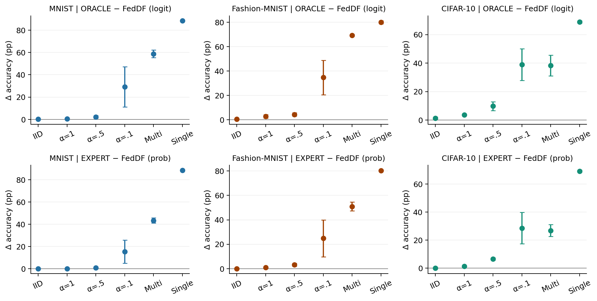
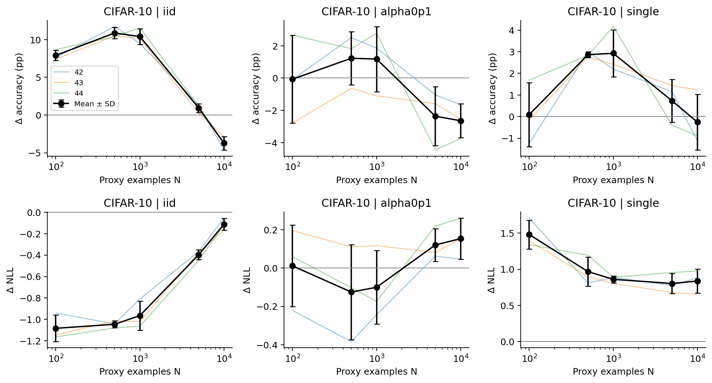

# Article 1 — plan de redacción y cierre científico

Base de esta revisión: merge `f4d28ecbe2714332af1fe6ea3131f234ade8e6de`.
Evidencia: `docs/article1_closure/`, instantánea UTC 2026-09-09 21:48:49.
Este documento interpreta las tablas publicadas; no repite la auditoría de los caches privados.

## Decisión editorial

**Sí, empezar la redacción ahora.** El diseño principal de seis métodos, el supervisado y la curva CIFAR están completos según el manifiesto. «Cerrado» significa cobertura y comprobaciones del protocolo implementado; no equivale a artículo listo para enviar, novedad bibliográfica demostrada o hipótesis confirmada.

Título de trabajo: **Who and What to Teach: Expertise-Aware Distillation under Client Specialization**.
Subtítulo/alcance explícito: **a controlled study with a labeled public proxy**.

Mensaje: seleccionar teachers acreditados por clase puede recuperar gran parte del rendimiento que pierde la agregación uniforme bajo especialización; cambiar el operador, restringir soporte y disponer de más etiquetas públicas afectan de forma distinta al target y al student. La utilidad de KD debe juzgarse también frente al entrenamiento supervisado sobre ese proxy.

No venderlo como SOTA universal, método sin etiquetas, solución data-free ni demostración de superioridad constante frente a CE. Tampoco presentar los seis métodos como seis contribuciones nuevas.

## Del plan inicial a la evidencia actual

| Eje | Evidencia publicada | Estado editorial |
|---|---|---|
| Datos y teachers | 54 condiciones, diez checkpoints por condición; train/validation/expertise 70/10/20 | Describir protocolo y limitaciones |
| Máscara binaria | 54 fuentes verificadas; recuentos, accuracy, cobertura y fallback | Diagnóstico completo; precisión de M no validada en test local independiente |
| WHO: selección | ORACLE-logit vs FedDF-logit y EXPERT-prob vs FedDF-prob, 54 pares cada uno | Resultado principal |
| HOW: operador | FedDF y ORACLE prob vs logit, 54 pares cada uno, T=8 | Resultado condicionado a routing y T; no equivalencia general |
| WHAT: soporte | EXPERT-prob-SR vs EXPERT-prob, 54 pares | Ablación principal |
| Etiquetas públicas | 9 CE únicos, reutilizados en 54 pares con EXPERT | Comparación obligatoria en cuerpo principal |
| Presupuesto N | 60 ejecuciones CIFAR únicas, 45 pares; incluye 12 anclas ya existentes y 48 ejecuciones adicionales | Completo, solo CIFAR y tres regímenes |
| Controles y EXPERT-logit archivados | 164/216 ejecuciones; 41/54 pares por brazo | Suplemento provisional o completar condiciones faltantes |
| Temperatura y regla de M | No acreditadas como barridos completos por esta instantánea | Robustez pendiente, no resultado negativo ni ausente por definición |
| Unlabeled/inversión/personalización | Propuestas, no métodos evaluados aquí | Siguientes trabajos |

No sumar las 60 celdas de curva como 60 entrenamientos nuevos: nueve KD N=10000 y tres CE ya están contabilizados. El programa principal consta de 324 KD + 9 CE + 48 celdas nuevas = **381 ejecuciones de students**, además de 540 teachers. Las 164 KD archivadas adicionales son un bloque distinto.

## Resultados que deben conducir la narración

Todas las cifras siguientes son medias de diferencias emparejadas, tres seeds; accuracy en puntos porcentuales (pp). La SD está en las tablas originales y las figuras.

| Afirmación delimitada | Evidencia | Límite |
|---|---|---|
| EXPERT evita buena parte de la degradación de la agregación uniforme bajo especialización | En CIFAR, EXPERT-prob−FedDF-prob: −0.08 pp IID, +28.56 alpha0p1, +26.87 multi, +69.29 single | Regímenes no forman una intervención causal unidimensional; y(x) añade información |
| Probabilidades y logits no son intercambiables | FedDF-prob−FedDF-logit CIFAR alpha0p1: +12.54 pp, multi: +11.39 pp a T=8 | ORACLE tiene otro patrón; no extrapolar a EXPERT ni otras T |
| ORACLE no es una cota garantizada | ORACLE-prob−EXPERT-prob CIFAR alpha0p1: −4.06 pp | La selección correcta por muestra no optimiza directamente el student |
| Mejorar fidelidad del target no garantiza mejorar el student | SR−full CIFAR IID: target accuracy +9.53 pp; student accuracy −6.53 pp | El proxy es entrenamiento y usa etiquetas; no demuestra mecanismo causal de dark knowledge |
| Las etiquetas públicas limitan la ventaja práctica de KD | A N=10000, EXPERT-prob tiene menor accuracy media que CE en los seis regímenes CIFAR | La NLL puede seguir otro patrón; no atribuir todo el contraste a conocimiento privado porque cambia CE/KD |
| La ventaja depende de N y del régimen | CIFAR IID: +10.88 pp N=500; +10.41 N=1000; −3.73 N=10000 | Solo tamaños evaluados, T y presupuesto fijados; el cambio de signo no es N óptimo |
| Accuracy y NLL aportan conclusiones distintas | CIFAR single N=1000: +2.93 pp de accuracy, pero ΔNLL +0.861 | No hablar de «mejor rendimiento» sin indicar métrica |

Fuentes: `main_contrast_summary.csv`, `private_knowledge_summary.csv`, `proxy_curve_summary.csv` y `proxy_curve_paired.csv` bajo `docs/article1_closure/tables/`.

## Secciones del manuscrito

1. **Abstract (redactar al final).** Problema, setting labeled, selección/routing y dos resultados representativos acompañados de la limitación frente a CE. No convertir todas las comparaciones en claims de superioridad.
2. **Introduction.** (a) Fusionar salidas especializadas no es intercambiar teachers equivalentes. (b) Separar WHO/HOW/WHAT. (c) Formular EXPERT y su presupuesto informacional M+y. (d) Enumerar contribuciones: estudio controlado, regla de routing y límites de soporte/presupuesto. Cerrar con límites empíricos, no promesa universal.
3. **Related work.** Federated distillation, one-shot y data-free, mixtures/routing y distillation con ensemble. Distinguir adaptación del operador FedDF de reproducción integral del algoritmo original. Revisar literatura reciente y novedad antes de fijar venue; este documento no constituye una revisión SOTA exhaustiva.
4. **Setting and methods.** K=10; datos privados y proxy etiquetado; M y umbrales; reglas de selección, temperatura, operadores, fallback y KL. Tabla que señale uso de M/y por método. Aclarar que ORACLE selecciona aciertos por muestra y que la etiqueta del proxy ya participa en el target.
5. **Experimental protocol.** Tres datasets, seis regímenes, tres seeds, proxy anidado, validación/expertise separadas; MnistNet para MNIST/FMNIST y ResNet9 para CIFAR (ver código, no llamar LeNet/ResNet18). Documentar receta real y hashes; teachers Adam, students AdamW, 1200 updates. No reutilizar recetas históricas del chat.
6. **Results.** 6.1 Selección frente a uniformidad. 6.2 Operador condicionado al routing. 6.3 Soporte: fidelidad target vs student. 6.4 CE como comparación de igual disponibilidad de etiquetas. 6.5 Curva CIFAR: ganancias y pérdidas según N, accuracy y NLL juntas.
7. **Discussion and limitations.** Coste de M+y; baja evidencia en algunas celdas; validación de checkpoints separada pero M sin test local; especificidad/OOD no acreditada; tres seeds; tipos/cantidades de heterogeneidad; fallback; T fija; objetivos CE/KD; conocimiento previo del test e historial de decisiones. Costes de teachers y comunicación no medidos como ventaja de eficiencia.
8. **Conclusion.** Qué aporta routing y dónde deja de bastar. Separar extensión sin etiquetas de la evaluación actual.

### Borrador de apertura (Introduction, roles explícitos)

**Problema.** En la destilación federada de una sola ronda, el servidor debe combinar modelos que pueden haber aprendido sobre distribuciones de clases muy distintas. La agregación uniforme trata sus salidas como contribuciones intercambiables, aunque una predicción fuera de la especialidad de un teacher puede aportar información poco útil para el estudiante.

**Diseño.** Estudiamos este problema con un proxy público etiquetado y una máscara binaria de competencia cliente–clase. Separamos la selección de quién contribuye, el operador que combina sus salidas y el soporte de clases que se conserva. La regla EXPERT selecciona los teachers acreditados para la etiqueta de cada ejemplo proxy y promedia sus distribuciones completas.

**Evidencia y límite.** El estudio compara estas decisiones manteniendo teachers, proxy, inicialización y presupuesto compartidos, y añade entrenamiento supervisado sobre el mismo proxy. Los resultados muestran ganancias grandes frente a agregación uniforme en condiciones especializadas, pero también pérdidas al restringir soporte y una ventaja sobre supervisado que depende del tamaño del proxy y del régimen. Por ello, evaluamos tanto la utilidad del routing como los límites del conocimiento destilado cuando hay etiquetas públicas disponibles.

Mapa: problema → mecanismo propuesto, no causalidad empírica demostrada; diseño → código/protocolo; evidencia → seis contrastes completos + comparación CE + curva CIFAR. No afirmar novedad hasta cerrar Related Work.

## Figuras y tablas para escribir

Notebook editorial: `notebooks/article1_paper.ipynb`. Lee tablas públicas versionadas para contrastes; los diagnósticos absolutos y la masa externa requieren el CSV auditado local. No requiere datasets/checkpoints.

- Routing: ORACLE−FedDF y EXPERT−FedDF por dataset/régimen, accuracy y NLL.
- Operador: prob−logit para FedDF y ORACLE, con T=8 explícita.
- Soporte: SR−full en student; acompañar en texto/tablas con fidelidad del target.
- Etiquetas públicas: EXPERT−CE N=10000 en todos los regímenes.
- Presupuesto: curva CIFAR con puntos/líneas por seed, media y SD para Δaccuracy y ΔNLL.
- Tabla principal de efectos: unidades explícitas, tres pares por condición. No reconstruir SD de métodos a partir de SD de diferencias.

Las tablas main publicadas contienen resúmenes, no todos los pares por seed: sus figuras muestran **media ± SD**, sin puntos individuales inventados. La curva sí publica 45 pares y permite mostrar las seeds. Para el envío, exportar también tablas de rendimiento absoluto por método y pares principales desde la instantánea original, conservar un archivo duradero y redactar captions definitivos. No derivar intervalos formales de estos resúmenes como sustituto del análisis por seed.

## ¿Faltan ejecuciones?

**Ninguna para completar el diseño principal actual.** No relanzar baseline, supervised o proxy-curve por cambios de documentación. Sí quedan decisiones de alcance antes del envío:

- Si mantenemos el contraste directo EXPERT-prob/logit del plan inicial en todos los datasets/regímenes, faltan 13 celdas EXPERT-logit. Si el contraste será solo focal CIFAR, el manifiesto acredita 2/9 anclas: faltan 7. Son alternativas, no costes acumulativos.
- Si mantenemos Consensus/Energy como controles principales completos, faltan 13 por método, 26 en total. Confidence añade otras 13. Completar los cuatro brazos archivados costaría 52 KD; no es un requisito automático del diseño mínimo.
- Antes de lanzar, crear una lista por identidad y reconciliar resultados archivados con el destino del runner. `--skip-existing` en otro CSV no garantiza reutilizar el respaldo y podría repetir celdas.
- Temperatura T=1/4 para EXPERT-prob/logit: 36 celdas focales potenciales si no existen en fuentes adicionales; T=8 se reutiliza/completa. Necesario solo para ampliar la afirmación fuera de T=8, recomendable si el operador será una contribución central. No elegir T con test ni combinar nuevas decisiones como si fueran previas al estudio.
- Un control de soporte de entrenamiento (`M=1` si la clase está presente) frente a expertise evaluada ayudaría a separar conocer clases de acreditar competencia. No implementado/evaluado: sería útil si se reivindica el valor específico de medir accuracy para construir M, especialmente fuera de single. Definirlo antes de ejecutar, con identidad distinta.
- Sensibilidad de umbral, nuevas seeds y generalización a otras arquitecturas/datasets son robustez o ampliaciones, no celdas faltantes. Priorizar según los claims y el venue; no multiplicar grids indiscriminadamente.

## Corto y medio plazo

**Ahora:** congelar evidencia, producir figuras editoriales, redactar método/protocolo/resultados y publicar las limitaciones. Revisar discrepancias de procedencia: el manifiesto registra varios commits KD; no atribuir uno solo a todas las ejecuciones.

**Antes del primer manuscrito completo:** actualizar bibliografía, decidir la pregunta concreta de cada control pendiente, exportar rendimiento absoluto y pares del snapshot, y verificar una celda por identidad si hay una duda concreta de equivalencia de runtime. Deserializar checkpoints en CPU para cotejar hashes de estado sigue siendo una auditoría posible, no una nueva inferencia; la revisión previa solo certificó bytes/presencia y hashes declarados.

**Antes del envío:** cerrar los experimentos adicionales explícitamente elegidos, captions, discusión de presupuesto informacional y contribución frente a literatura. Conservar resultados nulos/negativos. Revisión adversarial del manuscrito completo.

**Trabajos siguientes:** (1) construir/estimar M con incertidumbre y rechazo OOD; (2) viabilidad de proxy unlabeled y síntesis por coordenadas, empezando por degeneración de especialistas single; (3) proxy sintético mediante inversión/data-free; (4) segunda destilación/personalización con class masks. Son líneas a delimitar, no resultados ni número de artículos comprometido.

## Autorrevisión

- Contribución: estudio controlado y routing explícito; novedad bibliográfica pendiente.
- Claridad: WHO/HOW/WHAT distintos; labeled en título/resumen/setting.
- Fuerza experimental: seis contrastes completos y curva; tres seeds, controles parciales.
- Cobertura: CE obligatorio, NLL junto a accuracy; no afirmar generalización unlabeled.
- Método: M no acredita OOD; routing usa y; no demostrar utilidad de medir expertise frente a soporte sin el control correspondiente.

Fuentes primarias de partida (no revisión exhaustiva):
- FedDF: https://proceedings.neurips.cc/paper/2020/hash/18df51b97ccd68128e994804f3eccc87-Abstract.html — fusión por ensemble distillation con datos unlabeled; distinguir presupuesto de este estudio.
- DENSE: https://papers.nips.cc/paper/2022/hash/868f2266086530b2c71006ea1908b14a-Abstract-Conference.html — escenario data-free one-shot, relacionado pero distinto; no añadirlo mecánicamente como celda del mismo protocolo.

## Vistas editoriales generadas

Caption provisional: diferencias emparejadas de accuracy en pp, media ± SD de tres seeds; primera fila ORACLE-logit−FedDF-logit, segunda EXPERT-prob−FedDF-prob. Los operadores y presupuestos informacionales difieren entre filas. Los ejes verticales se ajustan por panel.

Caption provisional: EXPERT-prob−CE en accuracy (pp, arriba) y NLL (abajo), con 1200 actualizaciones. Líneas de color: tres seeds observadas; negro: media ± SD. CE se reutiliza entre regímenes. Una diferencia positiva favorece KD en accuracy y la desfavorece en NLL. No interpretar los cambios de signo como tamaños óptimos.

Validación de esta revisión: 85 pruebas correctas y 8 omitidas por ausencia de PyTorch/torchvision; lint de archivos nuevos correcto. Todas las celdas del notebook se ejecutaron secuencialmente en IPython sobre las tablas publicadas y generaron nueve figuras PNG/PDF y tres CSV. El arranque de un kernel Jupyter falló por restricciones de sockets; no se declara ejecución mediante nbclient. Se inspeccionaron visualmente las figuras de routing y curva. No se entrenaron modelos, no se usó CUDA y no se volvieron a auditar caches privados.
